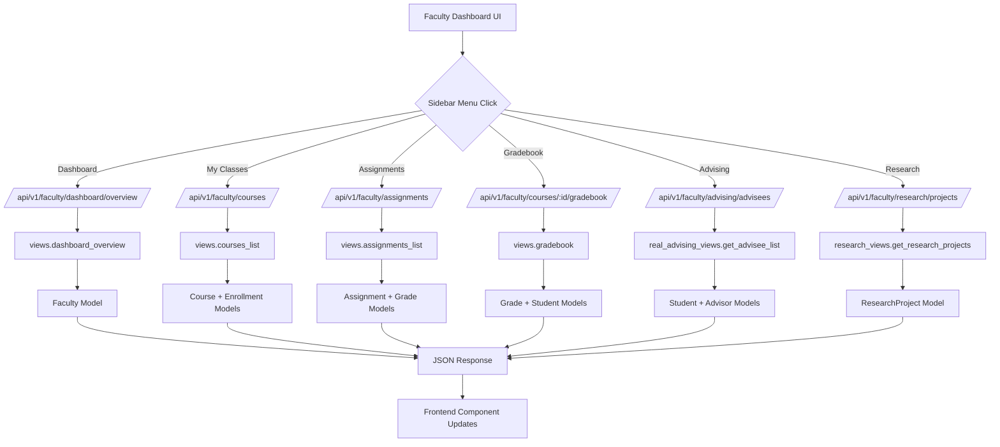

# Faculty Dashboard Architecture - After Fix

## Request Flow Diagram



## URL Routing Structure (Fixed)

### Before Fix (PROBLEMATIC)
```
/faculty/courses/                  -> course_views.get_faculty_courses (LINE 26)
/faculty/courses/                  -> views.courses_list (LINE 61) ❌ DUPLICATE
/faculty/courses/<id>/             -> course_views.get_course_detail (LINE 29)
/faculty/courses/<id>/             -> views.course_detail (LINE 62) ❌ DUPLICATE
/faculty/research/projects/        -> views.research_projects ❌ WRONG VIEW
```

### After Fix (CORRECTED)
```
ORGANIZED BY PRIORITY:

1. Dashboard
   /faculty/dashboard/overview/           -> views.dashboard_overview ✅

2. Courses (Consolidated)
   /faculty/courses/                      -> views.courses_list ✅
   /faculty/courses/search/               -> course_views.search_courses ✅
   /faculty/courses/create/               -> course_views.create_course ✅
   /faculty/courses/<id>/                 -> views.course_detail ✅
   /faculty/courses/<id>/gradebook/       -> views.gradebook ✅

3. Assignments
   /faculty/assignments/                  -> views.assignments_list ✅
   /faculty/assignments/<id>/             -> views.assignment_detail ✅

4. Advising
   /faculty/advising/advisees/            -> real_advising_views.get_advisee_list ✅
   /faculty/advising/advisees/<id>/       -> real_advising_views.get_advisee_detail ✅

5. Research (NEW - Properly Implemented)
   /faculty/research/projects/            -> research_views.get_research_projects ✅
   /faculty/research/projects/create/     -> research_views.create_research_project ✅
   /faculty/research/projects/<id>/       -> research_views.get_research_project_detail ✅
   /faculty/research/projects/<id>/update/ -> research_views.update_research_project ✅
```

## Component to API Mapping

| UI Component | API Endpoint | View Function | Data Model |
|-------------|-------------|---------------|------------|
| FacultyDashboardView | /faculty/dashboard/overview/ | views.dashboard_overview | Course, Assignment, Student |
| FacultyCoursesView | /faculty/courses/ | views.courses_list | Course, Enrollment |
| FacultyAssignmentsView | /faculty/assignments/ | views.assignments_list | Assignment, Grade |
| FacultyGradebookView | /faculty/courses/:id/gradebook/ | views.gradebook | Grade, Student |
| FacultyAdvisingView | /faculty/advising/advisees/ | real_advising_views.get_advisee_list | Student |
| FacultyResearchView | /faculty/research/projects/ | research_views.get_research_projects | ResearchProject |

## Authentication Flow

```
Frontend Request
    ↓
API Call (with Bearer Token)
    ↓
Django Middleware (FacultyRoleMiddleware)
    ↓
@faculty_required Decorator
    ↓
request.faculty (authenticated Faculty object)
    ↓
View Function (filters by request.faculty.employee_id)
    ↓
Database Query (only user's data)
    ↓
JSON Response
```

## Data Transformation

### Research Projects Example

**Database (ResearchProject model)**:
```python
{
    'id': 1,
    'title': 'ML in Healthcare',
    'description': 'Exploring ML algorithms...',
    'status': 'ongoing',
    'start_date': '2024-01-15',
    'end_date': None,
    'budget': 50000
}
```

**API Response (research_views.py transformation)**:
```python
{
    'id': 1,
    'title': 'ML in Healthcare',
    'description': 'Exploring ML algorithms...',
    'status': 'ongoing',
    'startDate': '2024-01-15',        # ← Converted to camelCase
    'endDate': None,                  # ← Converted to camelCase
    'collaborators': 0,               # ← Count instead of array
    'publications': 0,                # ← Count instead of array
    'funding': 50000                  # ← budget renamed to funding
}
```

**Frontend (FacultyResearchView component)**:
```typescript
interface ResearchProject {
  id: number;
  title: string;
  description: string;
  status: "draft" | "proposal" | "ongoing" | "completed" | "published";
  startDate: string;                 // ← Matches API response
  endDate?: string;                  // ← Matches API response
  collaborators: number;             // ← Matches API response
  publications: number;              // ← Matches API response
  funding: number;                   // ← Matches API response
}
```

## Error Handling Chain

```
Frontend Component
    ↓
try-catch block
    ↓
API Call (lib/faculty/api.ts)
    ↓
authenticatedFetch with error logging
    ↓
Backend View with @faculty_required
    ↓
try-except with traceback
    ↓
JsonResponse with error details
    ↓
Frontend error state display
```

## Key Improvements

1. ✅ **No Duplicate Routes** - Each endpoint has exactly one definition
2. ✅ **Proper View Mapping** - Research endpoints use research_views.py
3. ✅ **Consistent Authentication** - All views use @faculty_required decorator
4. ✅ **Data Format Alignment** - Backend transforms data to match frontend expectations
5. ✅ **Complete CRUD** - All create, read, update, delete operations implemented
6. ✅ **Error Tracebacks** - Backend logs full tracebacks for debugging
7. ✅ **User Isolation** - Data filtered by request.faculty.employee_id
