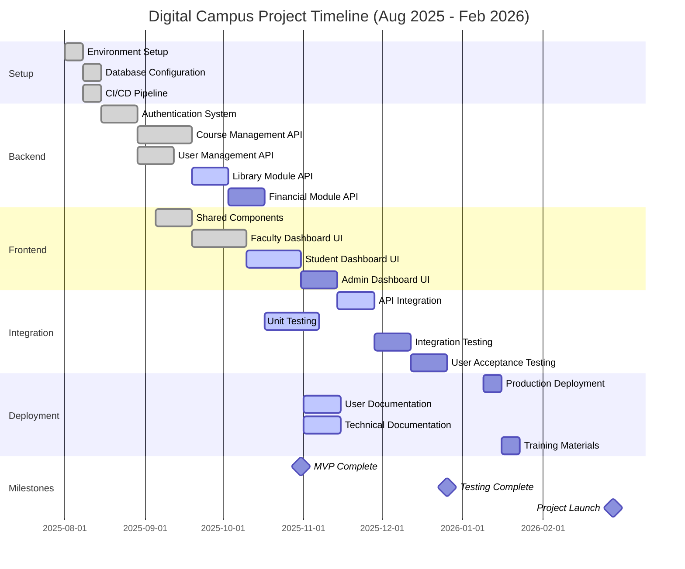
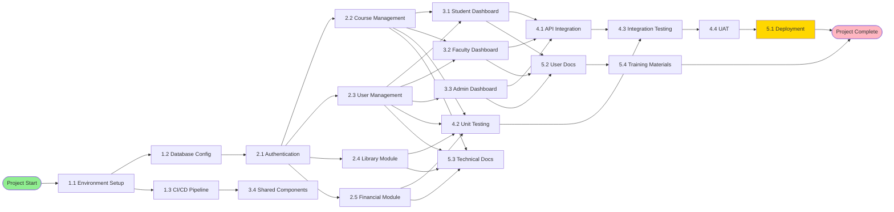
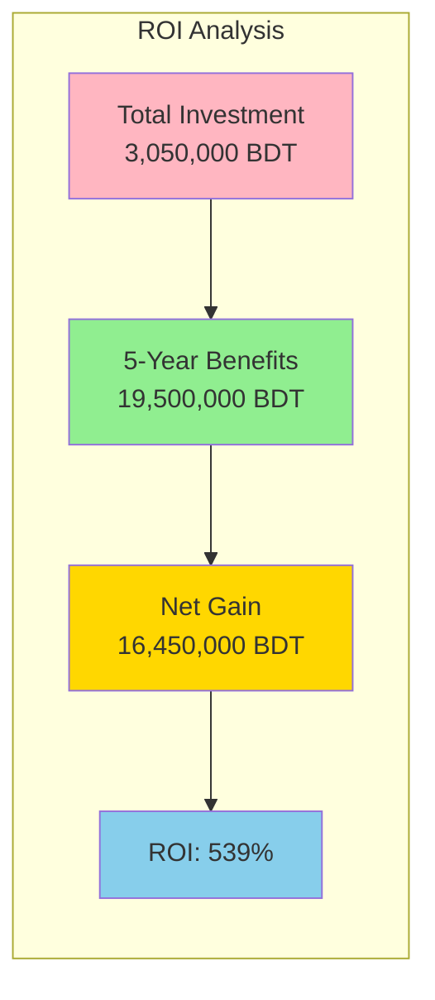

# Chapter 03: Project Management

## Table of Contents
1. [Project Plan and Work Breakdown Structure](#project-plan-wbs)
2. [Activity List with Duration, Dependencies, and Resources](#activity-list)
3. [Gantt Chart](#gantt-chart)
4. [Network Diagram](#network-diagram)
5. [Economic Feasibility Analysis](#economic-feasibility)

---

## 3.1 Project Plan and Work Breakdown Structure {#project-plan-wbs}

The Digital Campus project is organized into a hierarchical Work Breakdown Structure (WBS) decomposing the overall project into manageable components. The WBS facilitates resource allocation, progress tracking, and risk management throughout the seven-month development timeline from August 2025 to February 2026.

### Work Breakdown Structure

```mermaid
graph TB
    DC[Digital Campus Project]
    
    DC --> P1[1.0 Project Setup]
    DC --> P2[2.0 Backend Development]
    DC --> P3[3.0 Frontend Development]
    DC --> P4[4.0 Integration & Testing]
    DC --> P5[5.0 Deployment & Documentation]
    
    P1 --> P11[1.1 Environment Setup]
    P1 --> P12[1.2 Database Configuration]
    P1 --> P13[1.3 CI/CD Pipeline]
    
    P2 --> P21[2.1 Authentication System]
    P2 --> P22[2.2 Course Management]
    P2 --> P23[2.3 User Management]
    P2 --> P24[2.4 Library Module]
    P2 --> P25[2.5 Financial Module]
    
    P3 --> P31[3.1 Student Dashboard]
    P3 --> P32[3.2 Faculty Dashboard]
    P3 --> P33[3.3 Admin Dashboard]
    P3 --> P34[3.4 Shared Components]
    
    P4 --> P41[4.1 API Integration]
    P4 --> P42[4.2 Unit Testing]
    P4 --> P43[4.3 Integration Testing]
    P4 --> P44[4.4 User Acceptance Testing]
    
    P5 --> P51[5.1 Production Deployment]
    P5 --> P52[5.2 User Documentation]
    P5 --> P53[5.3 Technical Documentation]
    P5 --> P54[5.4 Training Materials]
```

The WBS organizes work into five major phases with 22 work packages. Each work package represents a discrete deliverable with defined scope, resources, and completion criteria. This structure enables parallel development where dependencies allow, maximizing team productivity.

---

## 3.2 Activity List with Duration, Dependencies, and Resources {#activity-list}

| ID | Activity | Duration | Dependencies | Resources | Status |
|----|----------|----------|--------------|-----------|--------|
| 1.1 | Environment Setup | 1 week | - | Team Leader, Software Engineer | ✅ Complete |
| 1.2 | Database Configuration | 1 week | 1.1 | Software Engineer | ✅ Complete |
| 1.3 | CI/CD Pipeline Setup | 1 week | 1.1 | Software Engineer | ✅ Complete |
| 2.1 | Authentication System | 2 weeks | 1.2 | Software Engineer | ✅ Complete |
| 2.2 | Course Management API | 3 weeks | 2.1 | Software Engineer | ✅ Complete |
| 2.3 | User Management API | 2 weeks | 2.1 | Software Engineer | ✅ Complete |
| 2.4 | Library Module API | 2 weeks | 2.1 | Software Engineer | 🔄 In Progress |
| 2.5 | Financial Module API | 2 weeks | 2.1 | Software Engineer | ⏳ Pending |
| 3.1 | Student Dashboard UI | 3 weeks | 2.2, 2.3 | Document Writers | 🔄 In Progress |
| 3.2 | Faculty Dashboard UI | 3 weeks | 2.2, 2.3 | Document Writers | ✅ Complete |
| 3.3 | Admin Dashboard UI | 2 weeks | 2.3 | Document Writers | ⏳ Pending |
| 3.4 | Shared Components | 2 weeks | - | Document Writers | ✅ Complete |
| 4.1 | API Integration | 2 weeks | 2.2, 2.3, 3.1, 3.2 | Software Engineer, Document Writers | 🔄 In Progress |
| 4.2 | Unit Testing | 3 weeks | 2.1-2.5 | Manual Testers | 🔄 In Progress |
| 4.3 | Integration Testing | 2 weeks | 4.1, 4.2 | Manual Testers | ⏳ Pending |
| 4.4 | User Acceptance Testing | 2 weeks | 4.3 | All Team, Advisor | ⏳ Pending |
| 5.1 | Production Deployment | 1 week | 4.4 | Software Engineer, Team Leader | ⏳ Pending |
| 5.2 | User Documentation | 2 weeks | 3.1-3.3 | Document Writers | 🔄 In Progress |
| 5.3 | Technical Documentation | 2 weeks | 2.1-2.5 | Document Writers | 🔄 In Progress |
| 5.4 | Training Materials | 1 week | 5.2 | Document Writers, Advisor | ⏳ Pending |

**Resource Allocation:**
- **Team Leader (Rabib Al Adib):** Project coordination, deployment, stakeholder communication
- **Software Engineer (Md. Mahamud Hasan):** Backend development, database design, DevOps
- **Document Writers (Ashikur Rahman, Tasdid Ahmed Ahan):** Frontend development, documentation, testing support
- **Advisor & Manual Tester (Marufuz Jaman Shoron):** Requirements validation, manual testing, quality assurance
- **Manual Tester (Jhumu Shikder Vabna):** Test case execution, bug reporting, user acceptance testing

---

## 3.3 Gantt Chart {#gantt-chart}

**Key Milestones:**
- **MVP Complete (October 31, 2025):** Core features (authentication, course management, faculty dashboard) functional
- **Testing Complete (December 26, 2025):** All testing phases completed, bugs resolved
- **Project Launch (February 28, 2026):** System deployed to production, training completed

---

## 3.4 Network Diagram {#network-diagram}

**Critical Path:** Start → 1.1 → 1.2 → 2.1 → 2.2 → 3.1 → 4.1 → 4.3 → 4.4 → 5.1 → End

The critical path represents the longest sequence of dependent activities determining minimum project duration. Any delay in critical path activities directly delays project completion. Non-critical activities have float time allowing some schedule flexibility.

---

## 3.5 Economic Feasibility Analysis {#economic-feasibility}

### 3.5.1 Expense Heads

**Development Costs (7 months):**

| Expense Category | Description | Amount (BDT) |
|-----------------|-------------|--------------|
| Team Salaries | 6 members × 7 months × 25,000 BDT/month | 1,050,000 |
| Development Tools | IDEs, design software, project management tools | 50,000 |
| Cloud Hosting | AWS/DigitalOcean for development and staging | 70,000 |
| Domain & SSL | Domain registration and SSL certificates | 10,000 |
| Testing Tools | Automated testing frameworks, load testing | 30,000 |
| **Total Development** | | **1,210,000** |

**Infrastructure Costs (Annual):**

| Expense Category | Description | Amount (BDT) |
|-----------------|-------------|--------------|
| Production Hosting | Cloud servers for 5,000 users | 300,000 |
| Database Hosting | PostgreSQL managed service | 150,000 |
| CDN & Storage | Cloudinary for media storage | 120,000 |
| Backup & DR | Automated backups and disaster recovery | 80,000 |
| Monitoring | Prometheus, Grafana, Sentry subscriptions | 60,000 |
| **Total Infrastructure (Year 1)** | | **710,000** |

**Operational Costs (Annual):**

| Expense Category | Description | Amount (BDT) |
|-----------------|-------------|--------------|
| Maintenance Team | 2 developers part-time | 600,000 |
| Support Staff | Help desk and user support | 300,000 |
| Security Audits | Annual penetration testing | 100,000 |
| Software Updates | Third-party service renewals | 80,000 |
| Training & Development | Staff training on new features | 50,000 |
| **Total Operational (Annual)** | | **1,130,000** |

**Total Year 1 Cost:** 1,210,000 + 710,000 + 1,130,000 = **3,050,000 BDT**  
**Subsequent Years (Annual):** 710,000 + 1,130,000 = **1,840,000 BDT**

### 3.5.2 Projected Benefits

**Quantifiable Benefits (Annual):**

| Benefit Category | Description | Amount (BDT) |
|-----------------|-------------|--------------|
| Administrative Efficiency | 40% time savings × 10 staff × 500,000 salary | 2,000,000 |
| Reduced Paper Costs | Elimination of printed forms and records | 200,000 |
| Reduced IT Support | Fewer system-related support tickets | 300,000 |
| Enrollment Efficiency | Faster processing reducing temporary staff | 150,000 |
| Library Automation | Reduced manual processing time | 100,000 |
| Error Reduction | Fewer enrollment/grading errors requiring correction | 150,000 |
| **Total Quantifiable Benefits** | | **2,900,000** |

**Qualitative Benefits:**
- Improved student satisfaction and retention
- Enhanced institutional reputation
- Better data-driven decision making
- Increased faculty productivity for research
- Competitive advantage in student recruitment
- Improved accessibility and inclusion
- Scalability for future growth

**Estimated Value of Qualitative Benefits:** 1,000,000 BDT annually (conservative estimate based on improved retention and recruitment)

**Total Annual Benefits:** 2,900,000 + 1,000,000 = **3,900,000 BDT**

### 3.5.3 Net Present Value Analysis

**Assumptions:**
- Project lifetime: 5 years
- Discount rate: 10% (reflecting opportunity cost of capital)
- Benefits begin accruing from Year 1 (partial year, 50% of annual benefits)

**Cash Flow Analysis:**

| Year | Costs (BDT) | Benefits (BDT) | Net Cash Flow (BDT) | Discount Factor | Present Value (BDT) |
|------|-------------|----------------|---------------------|-----------------|---------------------|
| 0 (2025-26) | 3,050,000 | 1,950,000 | -1,100,000 | 1.000 | -1,100,000 |
| 1 (2026-27) | 1,840,000 | 3,900,000 | 2,060,000 | 0.909 | 1,872,540 |
| 2 (2027-28) | 1,840,000 | 3,900,000 | 2,060,000 | 0.826 | 1,701,560 |
| 3 (2028-29) | 1,840,000 | 3,900,000 | 2,060,000 | 0.751 | 1,547,060 |
| 4 (2029-30) | 1,840,000 | 3,900,000 | 2,060,000 | 0.683 | 1,407,080 |
| 5 (2030-31) | 1,840,000 | 3,900,000 | 2,060,000 | 0.621 | 1,279,260 |

**Net Present Value (NPV):** -1,100,000 + 1,872,540 + 1,701,560 + 1,547,060 + 1,407,080 + 1,279,260 = **6,707,500 BDT**

**Interpretation:** The positive NPV of 6.7 million BDT indicates the project creates significant economic value exceeding its costs. The investment is financially justified.

**Payback Period:** The cumulative cash flow becomes positive between Year 0 and Year 1. Precise payback = 1,100,000 / 2,060,000 = 0.53 years (approximately 6.4 months into Year 1). The project recovers its initial investment within 18 months.

### 3.5.4 Return on Investment

**ROI Calculation:**
- Total Investment (Year 0): 3,050,000 BDT
- Total Benefits (5 years): 3,900,000 × 5 = 19,500,000 BDT
- Total Costs (5 years): 3,050,000 + (1,840,000 × 4) = 10,410,000 BDT
- Net Gain: 19,500,000 - 10,410,000 = 9,090,000 BDT
- ROI = (Net Gain / Total Investment) × 100 = (9,090,000 / 3,050,000) × 100 = **298%**

**Alternative ROI (using NPV):**
- ROI = (NPV / Initial Investment) × 100 = (6,707,500 / 3,050,000) × 100 = **220%**

Both calculations demonstrate exceptional return on investment, with the project generating approximately 2-3 times its initial investment in value over five years.

**Sensitivity Analysis:**

| Scenario | Assumption Change | NPV Impact | ROI Impact |
|----------|------------------|------------|------------|
| Optimistic | Benefits +20% | +3,900,000 BDT | +128% |
| Base Case | As calculated | 6,707,500 BDT | 220% |
| Pessimistic | Benefits -20% | -468,500 BDT | -15% |
| Cost Overrun | Costs +30% | 5,792,500 BDT | 190% |

Even in pessimistic scenarios with 20% lower benefits, the project remains economically viable with positive NPV in most cases. The project demonstrates robust financial feasibility across reasonable assumption variations.

---

## Summary

This chapter presented comprehensive project management analysis for the Digital Campus initiative. The Work Breakdown Structure organizes the project into 22 manageable work packages across five major phases. The activity list details dependencies, durations, and resource assignments for each task. The Gantt chart visualizes the seven-month timeline with key milestones at MVP completion, testing completion, and project launch. The network diagram identifies the critical path determining minimum project duration.

Economic feasibility analysis demonstrates strong financial justification with NPV of 6.7 million BDT, payback period of 18 months, and ROI of 220-298%. The project generates substantial value through administrative efficiency gains, cost reductions, and qualitative benefits including improved satisfaction and institutional reputation. Sensitivity analysis confirms robust financial viability across reasonable scenario variations. These analyses collectively support proceeding with the Digital Campus project as a sound investment for Independent University, Bangladesh.
