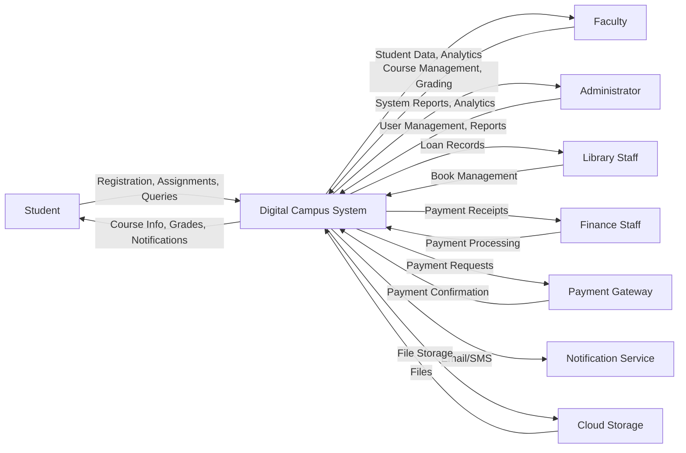
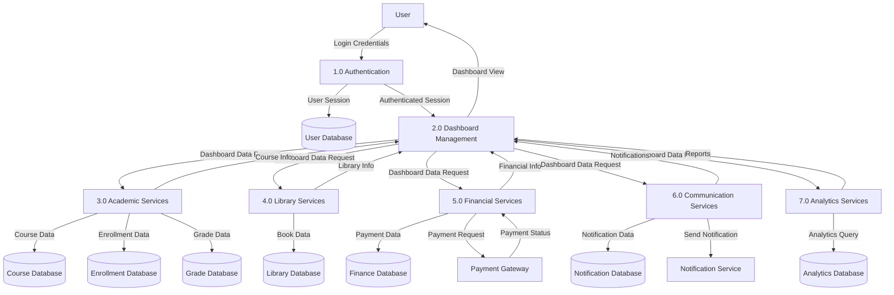
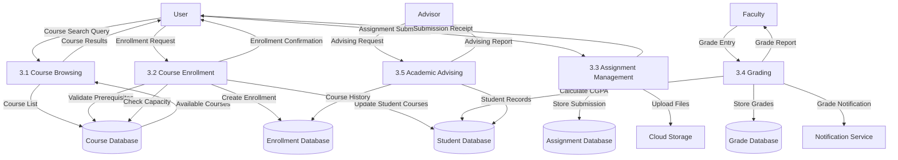
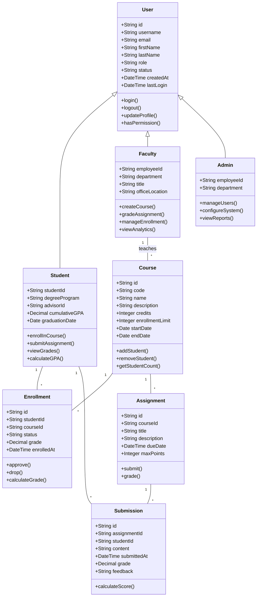
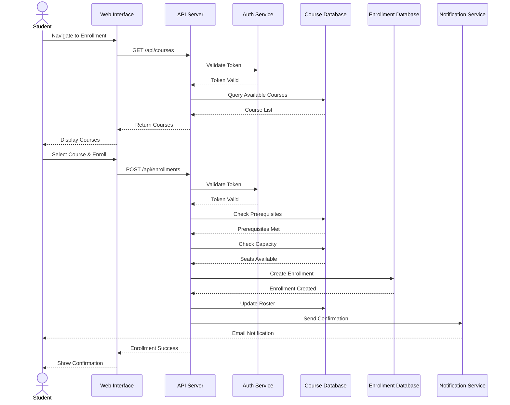
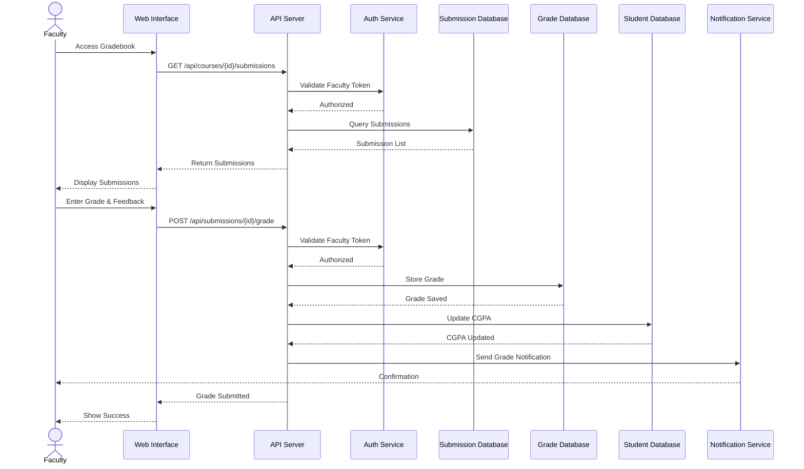
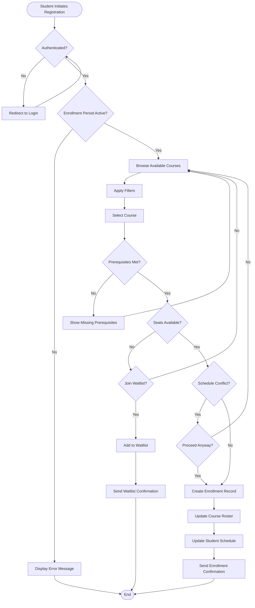
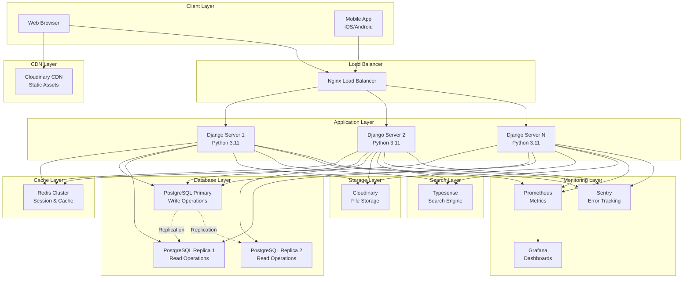
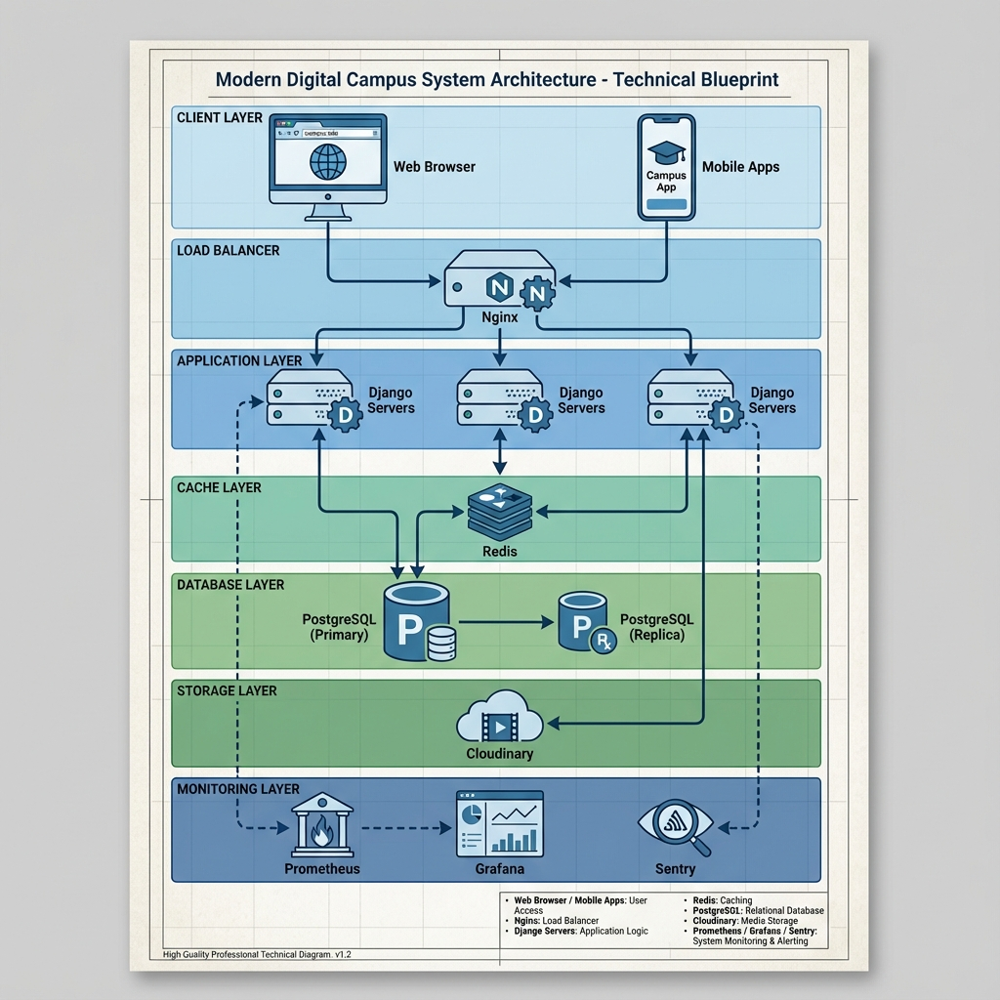

# Chapter 06: System Design

## Table of Contents
1. [Functional Requirements](#functional-requirements)
2. [Non-Functional Requirements](#non-functional-requirements)
3. [Data Flow Diagrams](#data-flow-diagrams)
4. [Object-Oriented Design](#object-oriented-design)
   - 4.1 [Use Case Diagram](#use-case-diagram)
   - 4.2 [Use Case Narrations](#use-case-narrations)
   - 4.3 [Class Diagram](#class-diagram)
   - 4.4 [Sequence Diagrams](#sequence-diagrams)
   - 4.5 [Activity Diagrams](#activity-diagrams)
   - 4.6 [Deployment Diagram](#deployment-diagram)

---

## 6.1 Functional Requirements {#functional-requirements}

The Digital Campus system encompasses comprehensive functionality across multiple domains to serve the entire university ecosystem. The functional requirements are organized by major subsystems.

### 6.1.1 Core Identity & Access Management
The system implements university-email-based authentication (abc@iub.edu.bd) with automated account provisioning. Single Sign-On (SSO) integration provides seamless access across all modules. The Role-Based Access Control (RBAC) system supports four primary roles: Student, Faculty, Admin, and Staff, with Attribute-Based Access Control (ABAC) enabling fine-grained permissions based on department, course, or other contextual attributes. Multi-factor authentication (MFA) enhances security for sensitive operations.

### 6.1.2 Dashboard & Personalization
Each user role receives a customized dashboard displaying relevant information. Students view their class schedule, upcoming assignments, CGPA, course recommendations, and notifications. Faculty dashboards show teaching schedule, student rosters, pending grading tasks, research projects, and advisee information. Admin dashboards provide system-wide analytics, user management tools, and configuration options. The system supports customizable widgets allowing users to personalize their dashboard layout and content priorities.

### 6.1.3 Academic Services
The course management subsystem handles course creation, enrollment, waitlist management, and section assignment. Students can browse available courses with advanced filtering by department, credits, schedule, and instructor. The enrollment cart allows students to plan their registration before the enrollment period opens. Automatic section creation occurs when courses reach capacity thresholds. Prerequisites are validated automatically during enrollment, with override request workflows for special cases.

The assignment and grading module supports multiple submission types (file upload, text entry, external links), versioning for resubmissions, and time-stamped tracking. Faculty can create rubrics, provide inline feedback, and manage grade distributions. The system calculates CGPA automatically and provides grade analytics.

### 6.1.4 Academic Advising & Progression
Advisors access comprehensive student profiles including academic history, current enrollment, and performance trends. The "What-if" CGPA simulator allows students to model the impact of retaking courses or achieving specific grades. Early warning alerts notify advisors when advisees' GPAs fall below thresholds. The integrated appointment scheduler manages advisor-student meetings with calendar integration and automated reminders.

### 6.1.5 Library Management
The library subsystem provides a comprehensive book catalog with smart search capabilities including faceted filtering, fuzzy matching, and availability status. Students can search, reserve, and check out books digitally. The system tracks loan history, calculates fines for overdue items, and manages digital resources. Library staff can manage inventory, process returns, and generate usage analytics.

### 6.1.6 Research Management
Faculty can create and manage research projects through their entire lifecycle from proposal to final report. The system tracks project milestones, budgets, collaborators, and publications. Ethics approval workflows ensure compliance with institutional review board requirements. Integration with publication databases allows automatic import of citation data.

### 6.1.7 Campus Life & Activities
Students can discover and join clubs and societies through a centralized portal. Club administrators manage membership, organize events, and submit funding requests. The competition and hackathon module supports registration, team formation, judge scoring, and leaderboard display. Student-created content (blogs, podcasts, galleries) undergoes moderation workflows before publication.

### 6.1.8 Financial Management
The finance module handles tuition and fee payment processing with integration to local payment gateways (bKash, Nagad, bank transfers). Scholarship management tracks eligibility, applications, and disbursements. The system generates invoices, payment receipts, and financial aid statements. Students can view their account balance, payment history, and upcoming due dates.

### 6.1.9 Communication & Notifications
Multi-channel notification delivery supports email, SMS, push notifications, and in-app messages. Administrators can broadcast campus-wide announcements, while departments and instructors can target specific audiences. The system prioritizes urgent messages and respects user notification preferences. Real-time chat enables student-advisor communication and group discussions.

### 6.1.10 Emergency & Safety
The panic button feature in the mobile app sends the user's location and a pre-filled emergency message to campus security. Mass alert systems can disseminate critical information via SMS, email, and push notifications simultaneously. Emergency contact directories provide quick access to security, medical, and administrative contacts. The system logs all emergency incidents for review and drill simulations.

### 6.1.11 Analytics & Reporting
Comprehensive dashboards provide insights into enrollment trends, course utilization, attendance patterns, library usage, and research outputs. Administrators can generate custom reports with flexible date ranges and filtering options. Predictive analytics identify at-risk students based on attendance and performance patterns. Data visualization tools present complex information through charts, graphs, and heatmaps.

### 6.1.12 Accessibility & Inclusion
The system implements WCAG 2.1 Level AA compliance ensuring screen reader compatibility, keyboard navigation, and sufficient color contrast. Multilingual support includes English and Bengali interfaces. Low-bandwidth mode optimizes content delivery for users with limited internet connectivity through compressed media and text-first rendering. Captions and transcripts accompany all video content.

---

## 6.2 Non-Functional Requirements {#non-functional-requirements}

### 6.2.1 Performance
The system must support 4,000+ concurrent users without degradation in response time. Page load times should not exceed 2 seconds for 95% of requests under normal load conditions. Database queries must be optimized with appropriate indexing to ensure sub-second response times. The system should handle peak loads during enrollment periods (up to 10,000 concurrent users) through horizontal scaling.

### 6.2.2 Security
All data transmission occurs over TLS 1.3 or higher ensuring encryption in transit. Sensitive data at rest is encrypted using AES-256 encryption. JWT tokens with short expiration times (15 minutes for access tokens, 7 days for refresh tokens) provide stateless authentication. The system implements protection against common vulnerabilities including SQL injection, XSS, CSRF, and clickjacking. Regular security audits and penetration testing ensure ongoing security posture.

### 6.2.3 Availability
The system targets 99.9% uptime (less than 8.76 hours downtime per year). Automated health checks monitor system components with immediate alerting for failures. Database replication provides redundancy with automatic failover. Regular backups occur every 6 hours with point-in-time recovery capability. Scheduled maintenance windows are announced 48 hours in advance and occur during low-usage periods.

### 6.2.4 Scalability
The architecture supports horizontal scaling by adding application server instances behind a load balancer. Database read replicas distribute query load. Redis clustering provides scalable caching. The system can scale from the current 5,000 users to 50,000+ users without architectural changes. Microservices architecture allows independent scaling of resource-intensive components.

### 6.2.5 Usability
The user interface follows modern design principles with intuitive navigation and consistent visual language. Mobile-responsive design ensures optimal experience across devices (desktop, tablet, mobile). Context-sensitive help and tooltips guide users through complex workflows. The system provides clear error messages with actionable recovery steps. User onboarding includes interactive tutorials for key features.

### 6.2.6 Maintainability
The codebase follows industry best practices with comprehensive documentation, consistent coding standards, and modular architecture. Automated testing (unit, integration, end-to-end) ensures code quality. Continuous integration/continuous deployment (CI/CD) pipelines automate testing and deployment. Comprehensive logging with structured log formats facilitates troubleshooting. Monitoring dashboards provide real-time visibility into system health.

### 6.2.7 Compatibility
The web application supports modern browsers (Chrome 90+, Firefox 88+, Safari 14+, Edge 90+). Mobile applications target iOS 13+ and Android 8+. The system provides REST APIs with versioning to ensure backward compatibility. Integration capabilities include standard protocols (OAuth 2.0, SAML, LDAP) for third-party system connectivity.

---

## 6.3 Data Flow Diagrams {#data-flow-diagrams}

### 6.3.1 Context Level DFD

### 6.3.2 System Level DFD

### 6.3.3 Level 1 DFD - Academic Services (Process 3.0)

---

## 6.4 Object-Oriented Design {#object-oriented-design}

### 6.4.1 Use Case Diagram {#use-case-diagram}

```mermaid
graph TB
    Student((Student))
    Faculty((Faculty))
    Admin((Administrator))
    LibStaff((Library Staff))
    
    subgraph "Authentication Subsystem"
        UC1[Login]
        UC2[Logout]
        UC3[Reset Password]
    end
    
    subgraph "Academic Subsystem"
        UC4[Browse Courses]
        UC5[Enroll in Course]
        UC6[Submit Assignment]
        UC7[View Grades]
        UC8[Create Course]
        UC9[Grade Assignment]
        UC10[Manage Enrollment]
    end
    
    subgraph "Library Subsystem"
        UC11[Search Books]
        UC12[Borrow Book]
        UC13[Return Book]
        UC14[Manage Inventory]
    end
    
    subgraph "Admin Subsystem"
        UC15[Manage Users]
        UC16[View Analytics]
        UC17[Configure System]
    end
    
    Student --> UC1
    Student --> UC2
    Student --> UC3
    Student --> UC4
    Student --> UC5
    Student --> UC6
    Student --> UC7
    Student --> UC11
    Student --> UC12
    Student --> UC13
    
    Faculty --> UC1
    Faculty --> UC2
    Faculty --> UC8
    Faculty --> UC9
    Faculty --> UC10
    
    Admin --> UC1
    Admin --> UC15
    Admin --> UC16
    Admin --> UC17
    
    LibStaff --> UC1
    LibStaff --> UC14
```

### 6.4.2 Use Case Narrations {#use-case-narrations}

#### UC5: Enroll in Course

**Actors:** Student (Primary), System (Secondary)

**Preconditions:**
- Student is authenticated and logged in
- Enrollment period is active
- Student has not exceeded credit limit

**Main Flow:**
1. Student navigates to course enrollment page
2. System displays available courses for student's program
3. Student searches/filters courses by department, schedule, or instructor
4. System displays filtered course list with availability status
5. Student selects desired course
6. System validates prerequisites and capacity
7. Student confirms enrollment
8. System creates enrollment record and updates course roster
9. System sends enrollment confirmation notification
10. System displays updated student schedule

**Alternative Flows:**
- **A1: Course Full** - If course is at capacity, system offers waitlist option
- **A2: Prerequisites Not Met** - System displays missing prerequisites and denies enrollment
- **A3: Time Conflict** - System warns about schedule conflicts and requires confirmation

**Postconditions:**
- Student is enrolled in the course
- Course roster is updated
- Student's schedule reflects new course
- Enrollment confirmation is sent

#### UC9: Grade Assignment

**Actors:** Faculty (Primary), System (Secondary)

**Preconditions:**
- Faculty is authenticated and assigned to the course
- Assignment submissions exist
- Grading rubric is defined

**Main Flow:**
1. Faculty navigates to course gradebook
2. System displays list of assignments
3. Faculty selects assignment to grade
4. System displays student submissions
5. Faculty reviews submission and enters grade
6. Faculty provides feedback comments
7. System validates grade against rubric
8. Faculty confirms grade submission
9. System stores grade and updates student record
10. System sends grade notification to student

**Alternative Flows:**
- **A1: Late Submission** - System applies late penalty based on course policy
- **A2: Plagiarism Detected** - System flags submission for review
- **A3: Grade Revision** - Faculty can modify previously entered grades with audit trail

**Postconditions:**
- Grade is recorded in system
- Student CGPA is updated
- Student receives grade notification
- Grade change is logged in audit trail

### 6.4.3 Class Diagram {#class-diagram}

### 6.4.4 Sequence Diagrams {#sequence-diagrams}

#### Sequence Diagram: Student Course Enrollment

#### Sequence Diagram: Faculty Grading Workflow

### 6.4.5 Activity Diagrams {#activity-diagrams}

#### Activity Diagram: Course Registration Process

### 6.4.6 Deployment Diagram {#deployment-diagram}

---

## System Architecture Overview

*Figure 6.1: Multi-tier System Architecture showing all layers and components*

## Summary

This chapter presented the comprehensive system design for the Digital Campus platform. The functional requirements cover twelve major subsystems ranging from core authentication to emergency management. Non-functional requirements ensure the system meets performance (4,000+ concurrent users), security (TLS, AES-256 encryption), and availability (99.9% uptime) targets.

The data flow diagrams illustrate information flow from context level through detailed process decomposition. The object-oriented design includes use case diagrams showing actor-system interactions, detailed use case narrations for key workflows, a comprehensive class diagram representing the domain model, sequence diagrams for critical operations, activity diagrams for complex processes, and a deployment diagram showing the multi-tier architecture.

The system architecture employs modern best practices including microservices, horizontal scaling, database replication, caching, and comprehensive monitoring. This design provides a robust foundation for implementing a scalable, secure, and user-friendly digital campus platform serving the Independent University, Bangladesh community.
