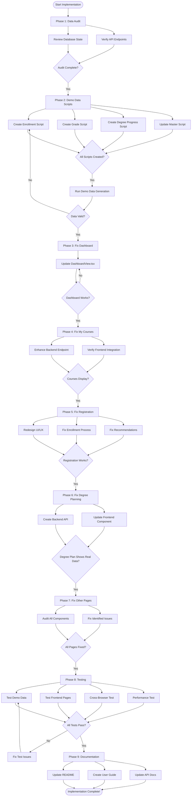
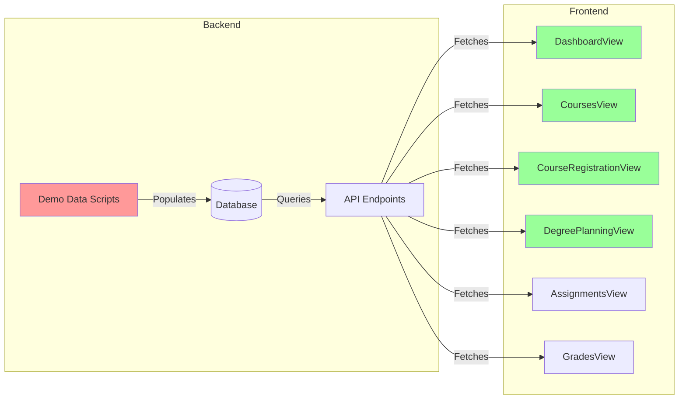
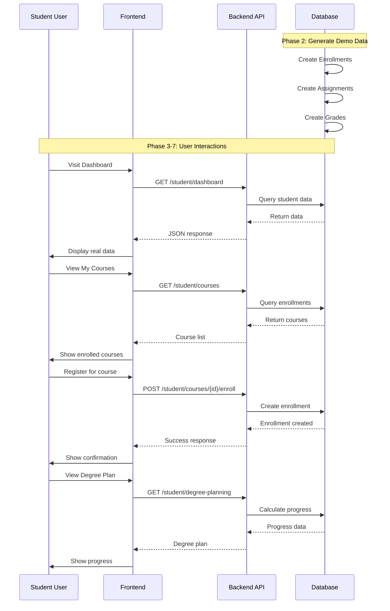

# Student Dashboard Fix - Implementation Roadmap



## Timeline Visualization

```
Week 1: Data & Core Fixes
==================================================
Day 1-2: [████████░░] Phase 1-2: Audit + Demo Data
Day 3:   [██████░░░░] Phase 3: Dashboard Fix
Day 4:   [████████░░] Phase 4-5: Courses + Registration
Day 5:   [██████░░░░] Phase 6: Degree Planning

Week 2: Polish & Testing
==================================================
Day 1-2: [████████░░] Phase 7: Other Pages
Day 3-4: [██████████] Phase 8: Testing
Day 5:   [████░░░░░░] Phase 9: Documentation

Legend: █ Work Time  ░ Buffer/Review
```

## Component Dependency Map



## Priority Matrix

```
    High Impact
        ↑
        │  ┌─────────────┐  ┌──────────────┐
        │  │ Phase 2     │  │ Phase 5      │
        │  │ Demo Data   │  │ Registration │
        │  └─────────────┘  └──────────────┘
        │
        │  ┌─────────────┐  ┌──────────────┐
        │  │ Phase 4     │  │ Phase 6      │
        │  │ My Courses  │  │ Degree Plan  │
        │  └─────────────┘  └──────────────┘
        │
        │  ┌─────────────┐  ┌──────────────┐
        │  │ Phase 3     │  │ Phase 7      │
        │  │ Dashboard   │  │ Other Pages  │
        │  └─────────────┘  └──────────────┘
        │
        └─────────────────────────────────────→
          Low Effort              High Effort

Priority Order: 2 → 5 → 4 → 6 → 3 → 7
```

## Data Flow Architecture



## File Modification Checklist

### 🔴 Critical Files (Must Modify)

- [ ] `addDemoData/generate_enrollment_data.py` (NEW)
- [ ] `addDemoData/generate_grade_data.py` (NEW)
- [ ] `addDemoData/generate_degree_progress_data.py` (NEW)
- [ ] `addDemoData/generate_all_data.py` (UPDATE)
- [ ] `frontend/src/components/student/DashboardView.tsx` (FIX)
- [ ] `frontend/src/components/student/DegreePlanningView.tsx` (FIX)
- [ ] `frontend/src/components/student/CourseRegistrationView.tsx` (ENHANCE)
- [ ] `backend/student/views.py` (ADD degree planning endpoint)

### 🟡 Important Files (Should Modify)

- [ ] `backend/student/course_views.py` (ENHANCE student courses)
- [ ] `frontend/src/components/student/CoursesView.tsx` (VERIFY)
- [ ] `addDemoData/generate_assignment_data.py` (ENHANCE)
- [ ] `addDemoData/README.md` (UPDATE)

### 🟢 Optional Files (Nice to Have)

- [ ] `Documentation/Student/STUDENT_DASHBOARD_GUIDE.md` (NEW)
- [ ] `QUICKSTART.md` (UPDATE)
- [ ] Other student components as identified

## Risk Mitigation Strategy

```
┌─────────────────────────────────────────────────┐
│ Risk Level    │ Action                          │
├─────────────────────────────────────────────────┤
│ 🔴 HIGH       │ Stop, review plan, get approval │
│ 🟡 MEDIUM     │ Proceed with caution, test well │
│ 🟢 LOW        │ Standard development process    │
└─────────────────────────────────────────────────┘

Phase 1: 🟢 LOW    - Read-only audit
Phase 2: 🟡 MEDIUM - Database modifications
Phase 3: 🟢 LOW    - Frontend only
Phase 4: 🟢 LOW    - Minor backend enhancement
Phase 5: 🟡 MEDIUM - Complex UI changes
Phase 6: 🟡 MEDIUM - New API endpoint
Phase 7: 🟢 LOW    - Component updates
Phase 8: 🟢 LOW    - Testing only
Phase 9: 🟢 LOW    - Documentation only
```

## Success Tracking Dashboard

```
┌────────────────────────────────────────────────────┐
│ STUDENT DASHBOARD FIX PROGRESS                     │
├────────────────────────────────────────────────────┤
│                                                    │
│ Overall Progress: ░░░░░░░░░░░░░░░░░░░░ 0%        │
│                                                    │
│ ✓ Phase 1: Analysis          ░░░░░░░░░░ 0/2      │
│ ☐ Phase 2: Demo Data          ░░░░░░░░░░ 0/4      │
│ ☐ Phase 3: Dashboard          ░░░░░░░░░░ 0/1      │
│ ☐ Phase 4: My Courses         ░░░░░░░░░░ 0/2      │
│ ☐ Phase 5: Registration       ░░░░░░░░░░ 0/3      │
│ ☐ Phase 6: Degree Planning    ░░░░░░░░░░ 0/2      │
│ ☐ Phase 7: Other Pages        ░░░░░░░░░░ 0/2      │
│ ☐ Phase 8: Testing            ░░░░░░░░░░ 0/4      │
│ ☐ Phase 9: Documentation      ░░░░░░░░░░ 0/3      │
│                                                    │
│ Total Tasks Completed: 0/23                        │
│ Estimated Time Remaining: 34 hours                 │
│                                                    │
└────────────────────────────────────────────────────┘
```

## Quick Command Reference

### Development Commands

```bash
# Generate demo data
cd addDemoData
python generate_all_data.py

# Run specific demo data script
python generate_enrollment_data.py

# Start backend server
cd backend
python manage.py runserver

# Start frontend dev server
cd frontend
npm run dev

# Run tests
cd backend
python manage.py test student

# Check database
cd backend
python manage.py shell
>>> from courses.models import Enrollment
>>> Enrollment.objects.count()
```

### Git Workflow

```bash
# Create feature branch
git checkout -b fix/student-dashboard-data-integration

# Commit changes by phase
git add addDemoData/generate_enrollment_data.py
git commit -m "Phase 2.1: Add enrollment data generation script"

# Push and create PR
git push origin fix/student-dashboard-data-integration
```

## Testing Checklist

### After Phase 2 (Demo Data)
- [ ] Run `generate_all_data.py` successfully
- [ ] Verify enrollments created in database
- [ ] Check assignments generated correctly
- [ ] Confirm grades calculated properly
- [ ] Validate data relationships

### After Phase 3 (Dashboard)
- [ ] Dashboard shows real enrolled courses
- [ ] Statistics are accurate
- [ ] No hardcoded data visible
- [ ] Loading states work
- [ ] Error handling works

### After Phase 4 (My Courses)
- [ ] All enrolled courses display
- [ ] Course details are correct
- [ ] No "no courses" message
- [ ] Instructor names show
- [ ] Progress bars accurate

### After Phase 5 (Registration)
- [ ] Course catalog loads
- [ ] Filtering works
- [ ] Can add to cart
- [ ] Enrollment succeeds
- [ ] Courses appear in My Courses
- [ ] Recommendations show

### After Phase 6 (Degree Planning)
- [ ] Real completion status
- [ ] Credits calculated correctly
- [ ] Requirements match major
- [ ] Graduation date accurate
- [ ] Recommendations relevant

### Final Testing (Phase 8)
- [ ] All pages work together
- [ ] Cross-browser compatible
- [ ] Mobile responsive
- [ ] Performance acceptable
- [ ] No console errors

## Resource Links

- **Main Plan:** [STUDENT_DASHBOARD_FIX_PLAN.md](./STUDENT_DASHBOARD_FIX_PLAN.md)
- **Summary:** [STUDENT_DASHBOARD_FIX_SUMMARY.md](./STUDENT_DASHBOARD_FIX_SUMMARY.md)
- **Demo Data README:** [addDemoData/README.md](./addDemoData/README.md)
- **Project Quickstart:** [QUICKSTART.md](./QUICKSTART.md)

## Contact & Support

For questions during implementation:
1. Review the detailed plan document
2. Check code comments and documentation
3. Test in development environment first
4. Reach out to team for assistance

---

**Roadmap Version:** 1.0  
**Last Updated:** December 22, 2024  
**Status:** 🚀 Ready to Begin

**Let's build something great!** 💪
